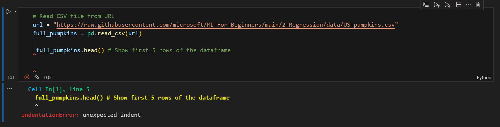
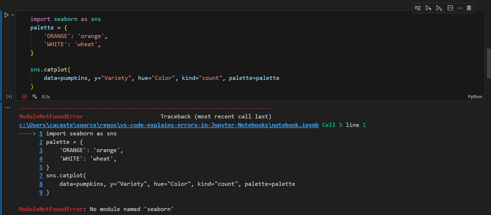
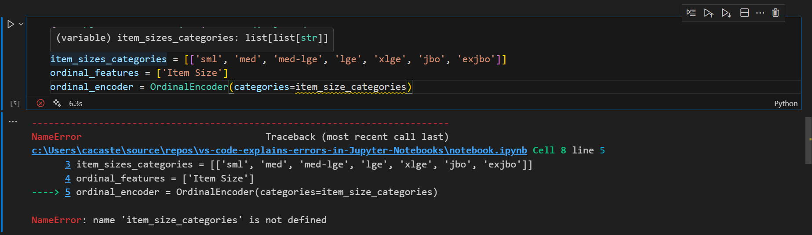

# Copilot Explains - Error troubleshooting in Jupyter Notebooks

Data scientists and AI engineers love to work with Jupyter Notebooks because they make so much easier to look at the result of each and every data exploration step or data modeling experiment and take decisions accordingly.
However, Jupyter notebooks are not immune to errors and sometimes understanding error messages - in particular if you aren’t a native English speaker or you are a beginner - and troubleshooting code might be painful and time consuming. 

In this repo, you'll find the code shown in [Copilot Explains Episode 6: Error troubleshooting in Jupyter Notebooks]().

The original Jupyter Notebook (version without errors) along with the related documentation is taken from [Lesson 4 - Logistic Regression](https://github.com/microsoft/ML-For-Beginners/tree/main/2-Regression/4-Logistic/?WT.mc_id=academic-111460-cacaste) of the [Machine Learning for Beginners](https://github.com/microsoft/ML-For-Beginners//?WT.mc_id=academic-111460-cacaste) open-source curriculum.

⚠️ **The notebook included in this repo contains errors for didactic purposes, so it will not execute successfully as it is.** You can use this as a base to follow along with the [video content]() and troubleshoot the errors with GitHub Copilot and VS Code. 

## Pre-requisites
To replicate the demo on **your local machine**, you need the following pre-requisites:
1. Install [VS Code](https://code.visualstudio.com/) on your machine
2. Sign up for a [GitHub Copilot free trial](https://github.com/github-copilot/signup/?WT.mc_id=academic-111460-cacaste) 
3. Install [GitHub Copilot](https://marketplace.visualstudio.com/items?itemName=GitHub.copilot&WT.mc_id=academic-111460-cacaste) and [GitHub Copilot Chat](https://marketplace.visualstudio.com/items?itemName=GitHub.copilot-chat&WT.mc_id=academic-111460-cacaste) extensions on VS Code
4. Install the [Python extension](https://marketplace.visualstudio.com/items?itemName=ms-python.python&WT.mc_id=academic-111460-cacaste) and the [Jupyter extension](https://marketplace.visualstudio.com/items?itemName=ms-toolsai.jupyter&WT.mc_id=academic-111460-cacaste) to work with Python Jupyter notebooks in VS Code 
5. [Create a virtual environment](https://code.visualstudio.com/docs/python/environments#_using-the-create-environment-command) with [numpy](https://pypi.org/project/numpy/) and [pandas](https://pypi.org/project/pandas/) packages installed

To run the demo on **the Cloud**, leveraging [GitHub Codespaces](https://github.com/features/codespaces/?WT.mc_id=academic-111460-cacaste), the only pre-requisite you need is GitHub Copilot enabled in your subscription (as per step 2 above). Then you can open your pre-configured environment on the browser, by clicking on the button below:

## Errors
[Copilot Explains episode 6]() covers 3 types of common errors when working with Python in Jupyter Notebooks.

### 1. Indentation Error
Whereas in other programming languages the indentation in code is for readability only, the indentation in Python is very important. Python uses indentation to indicate a block of code, so you have to use the same number of spaces in the same block of code, otherwise Python will give you an error, like in the example below.

### 2. Module Not Found Error
When you try to import in your code a library that is not installed in your development environment, you'll encounter a _ModuleNotFound_ error. In our example below, we are trying to use the [seaborn](https://seaborn.pydata.org/) library, which is not installed in our venv.

### 3. Name Error
_NameError_ usually occurs when you try to use a variable that has not been defined before usage or it's out of scope. Sometimes it can be due simply to a typo, making the variable name declared and used not match, as in the code cell below.

## GitHub Copilot Features
This demo leverages some of the GitHub Copilot features available in VS Code to troubleshoot and fix the errors above:

1. *Inline suggestions*: GitHub Copilot completes your code and markdown cell content as you type
2. *Chat*: GitHub Copilot offers a chat experience (both inline and in the sidebar) to get assistance in VS Code, avoiding context-switching
3. Several [*slash commands*](https://code.visualstudio.com/docs/editor/github-copilot#_slash-commands), such as:
   - /createNotebook -> to create a Jupyter Notebook with some specifications
   - /fix -> to get a suggestion to fix an error
   - /vscode -> to ask questions regarding working with VS Code
   - /explain -> to ask clarifications about code or error messages
   - /clear -> to clear the chat window
   - /document -> to get an AI auto generated documentation of your code

## Useful resources
To learn more about how to leverage GitHub Copilot in VS Code for different scenarios, check out the following resources:
- [Supercharging Your Data Science Projects with GitHub Tools](https://opendatascience.com/supercharging-your-data-science-projects-with-github-tools/?WT.mc_id=academic-111460-cacaste) blog on ODSC
- [Copilot Explains](https://www.youtube.com/watch?v=2cf02fD96bM&list=PLj6YeMhvp2S79zZvNkatCxVAvALHDwsn3/?WT.mc_id=academic-111460-cacaste) video series
- [GitHub Universe Cloud Skills Challenge](https://learn.microsoft.com/en-gb/training/challenges?id=ef5f9f41-0818-4895-9217-79d19827a322&WT.mc_id=academic-111460-cacaste) on Microsoft Learn

